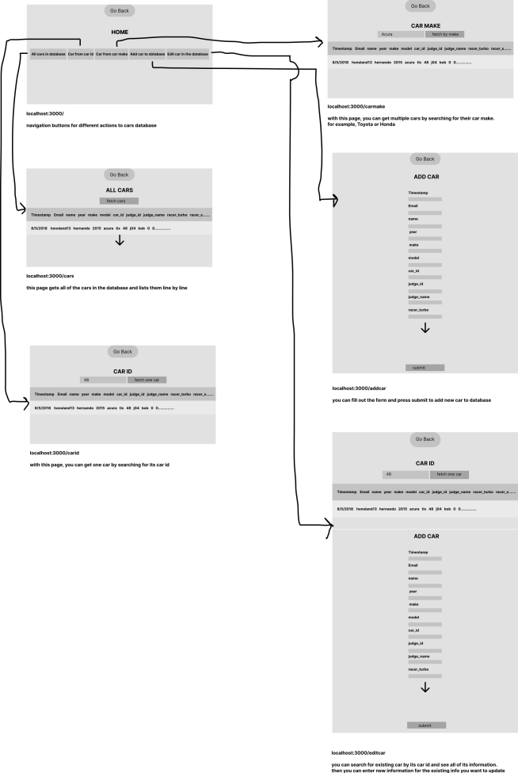

# LAB 4
## go to the command line in Lab4 folder
### run: npm run serverStart 
Lab 4 was the backend portion of this website. In lab 4, I made a sqlite3 database and put all of the cars information from the csv file into the database.

# LAB 5
##  go to the command line in cars-app folder
### run: npm run start 
Lab 5 was the frontend portion of this website. I made the website you can use to communicate with the database. You can view all of the cars from the database, search for one, add new car, and update exisitng car.

